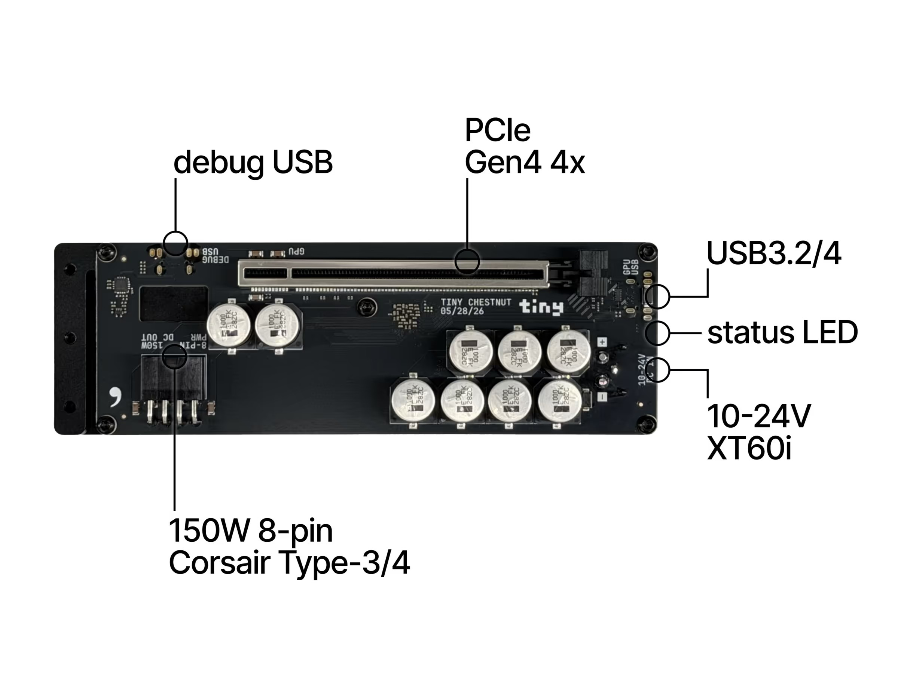

# Welcome to [COMMA_HACK 7](https://blog.comma.ai/comma-hack-7/)!

We put together this repo to help you get started with your chestnut.

Run chat, object detection, segmentation, and image classification with tinygrad on your PC or chestnut.

[tinygrad](https://github.com/tinygrad/tinygrad) makes it easy to run the same code and models on different platforms, from your laptop's CPU to GPUs and even comma four. Run on your PC to test out, then plug in a chestnut for real speed.

## Setup

```sh
git clone https://github.com/commaai/comma_hack_7.git
cd comma_hack_7
./setup.sh
```

## Run on PC

Activate the environment in each new terminal:

```sh
source .venv/bin/activate
```

These commands run on your PC's CPU.

### Chat

Chat with Qwen 3.5 0.8B (default) or Llama 3.2 1B. Models download on first run.

```sh
python examples/01_chat.py
python examples/01_chat.py --model llama3.2:1b
```

### YOLO

Detect objects or draw segmentation masks.

```sh
python examples/02_vision.py zidane.jpg --output boxes.jpg
python examples/02_vision.py zidane.jpg --model segment --output masks.jpg
```

### Camera

Run YOLO26 with a live preview
`--source` accepts a webcam index, video path, or stream URL.

```sh
python examples/03_camera.py
python examples/03_camera.py --model segment
```

### Image classification

Print the five most likely labels with ResNet18.

```sh
python examples/04_classify.py
python examples/04_classify.py zidane.jpg
```

## Run on chestnut

Plug in the 12V power and connect the USB3 cable from chestnut's USB3.2 port to your PC or comma.



In the activated environment, check the connection:

```sh
python tools/usb.py
```

Expected: `chestnut GPU check passed.`

Prefix any example command with `DEV=USB+AMD:LLVM` to run it on chestnut's GPU:

```sh
DEV=USB+AMD:LLVM python examples/01_chat.py
DEV=USB+AMD:LLVM python examples/02_vision.py zidane.jpg --output boxes.jpg
DEV=USB+AMD:LLVM python examples/03_camera.py
```

## Comma cameras

Stream the comma cameras to your PC. Inference runs on your PC's CPU or a chestnut connected to your PC.

### Setup

1. Add your PC's public SSH key to GitHub. On comma, open **Settings -> Developer**, enable **SSH**, and enter your **GitHub username** under **SSH keys**.
2. Find the comma's IP in **Settings -> Network** and use it as `<comma-ip>` below.

### Camera options

- **Road:** `--source comma:road`
- **Driver:** `--source comma:driver`
- **Wide road:** `--source comma:wide`
- Add `--model segment` for segmentation overlay.

Run this on your PC:

```sh
python examples/03_camera.py --host <comma-ip>
python examples/03_camera.py --host <comma-ip> --source comma:road

DEV=USB+AMD:LLVM python examples/03_camera.py --host <comma-ip>
```

## Performance

PC CPU: Threadripper PRO 5945WX. comma four CPU: Qualcomm SDM845.

| Model | PC CPU | Comma CPU | chestnut GPU |
| --- | ---: | ---: | ---: |
| YOLO26n | 526.07 ms | 1846.42 ms | 7.02 ms |
| YOLO26n-seg | 704.56 ms | 2349.27 ms | 7.98 ms |
| ResNet18 | 246.52 ms | 610.91 ms | 11.98 ms |
| Qwen 3.5 0.8B (Q8_0) | 2.98 tokens/s | 0.76 tokens/s | 45.46 tokens/s |
| Llama 3.2 1B Instruct (Q6_K) | 0.94 tokens/s | 0.34 tokens/s | 25.21 tokens/s |
